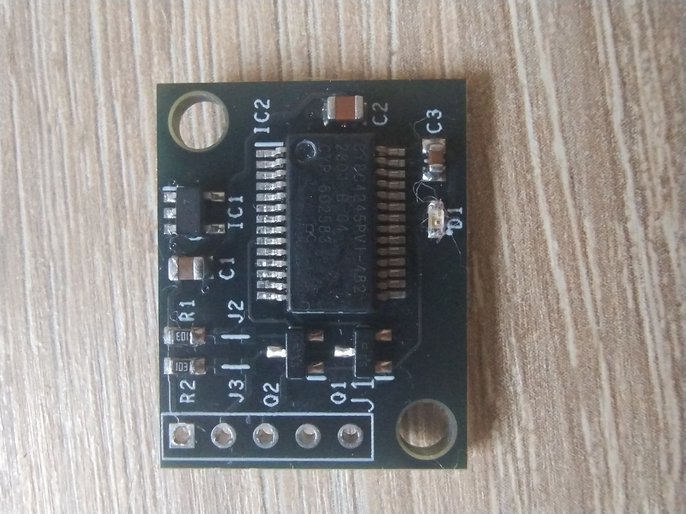
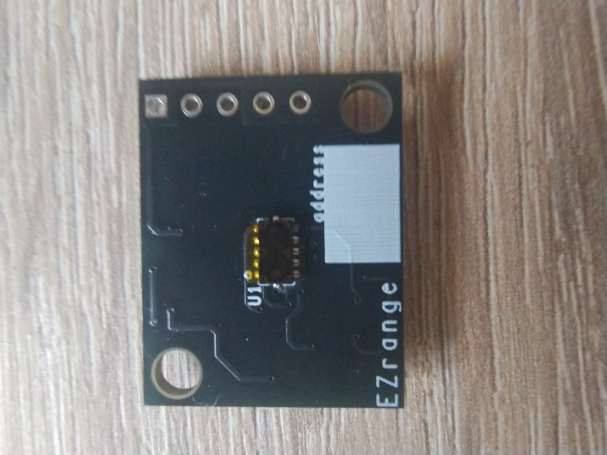

# Arduino Uno Template Workspace

This workspace provides an Arduino Uno host sketch for the VL53L4CD breakout board and VS Code tasks.

## Prerequisites

- Arduino CLI installed and available on your PATH.
- An Arduino Uno connected over USB.

## Getting Started

1. Update the board and port in .vscode/settings.json if needed.
2. Run the task "Arduino: Compile" to build the sketch.
3. Run the task "Arduino: Upload" to upload to the board.

## Sketch

- The default sketch is in src/VL53L4CD_Host.

## Board Images

## J1 Connector Pins

- Pin 1 (square): Vdd
- Pin 2: SDA
- Pin 3: SCL
- Pin 4: NU
- Pin 5: GND

## I2C Pull-ups

R1 and R2 are weak (10K) pull-ups. If you plan to use external pull-ups, cut jumpers J2 and J3.
